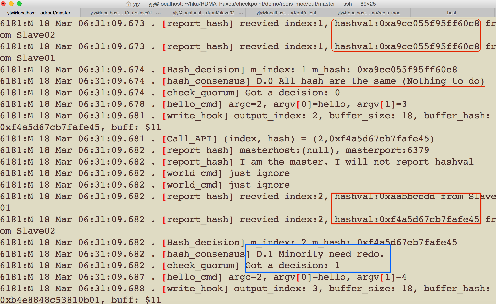

# A DEMO about how to do hash value proposal and make a decision based on hash value

## Environment
The demo will be showed on three different machines with Redis installed.

## DEMO Description

1. A client send request to the master.
2. H(master) will be calculated based on the output of the request through replacing the write() function.
3. Master will replicate the request to two slaves.
4. H(Slave01), H(Slave02) will be calculated at salves.
5. Two slaves report hash value to the master.
6. The master makes a decision based on the quorum of hash values.

## Run
1. Please modify the redis.conf to change listening ip and port in the out/.
2. sh run.sh
3. sh cli_test.sh

## Result
I implement a diversity command to force modifying the hash value in order to show some error cases.

Figure 1 showed at the 2nd round, The minority need redo because H(Slave01) is different from others.

 

## Conclusion
The demo shows that hash value is calculated based on the output. And when the master has collected all hash values, it can make a decision based on the quorum of hash values.
